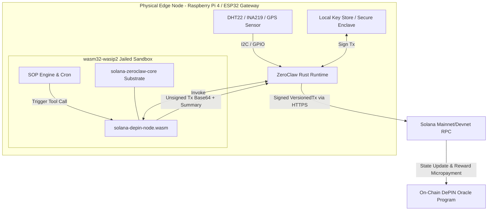

# `solana-depin-node` — ZeroClaw DePIN Edge Reference Implementation

`solana-depin-node` is a sandboxed WebAssembly component (`wasm32-wasip2`) tool plugin for **ZeroClaw**, enabling physical edge nodes (Raspberry Pi 4/5, ESP32 gateways, solar/weather monitoring stations) to directly report sensor telemetry and trigger state updates on the **Solana** blockchain.

---

## 🏗 Architecture & Wiring Diagram

Physical edge nodes run ZeroClaw self-hosted alongside physical sensors attached via **GPIO / I2C / SPI**. ZeroClaw's internal Standard Operating Procedure (**SOP**) engine monitors sensor thresholds or cron timers, automatically calling `solana_depin_report` to compile deterministic DePIN Oracle transactions.



### Hardware Wiring Example (Raspberry Pi 4 + INA219 Solar Power Sensor over I2C)

```
 +------------------------+             +------------------------+
 |   Raspberry Pi 4       |             |   INA219 Power Sensor  |
 |   (ZeroClaw Host)      |             |   (Solar Array Metric) |
 |                        |             |                        |
 |  Pin 1  (3.3V Power)   |------------>| VCC                    |
 |  Pin 6  (Ground)       |------------>| GND                    |
 |  Pin 3  (GPIO 2 / SDA) |------------>| SDA                    |
 |  Pin 5  (GPIO 3 / SCL) |------------>| SCL                    |
 +------------------------+             +------------------------+
```

---

## 🚀 How It Works (Addressing Agent Traps)

1. **Trap 1: Blockhash Expiry (Solved via Local Sign/Submit or Durable Nonces)**:
   For immediate edge reports, the plugin outputs a compiled unsigned `VersionedTransaction` with the recent blockhash. Because the edge node hosts its own signing key locally (never inside the WASM plugin!), signing and broadcasting happen atomically in $<100$ms. If human review is configured before submission, an optional `blockhash` / `durable_nonce` can be supplied.
2. **Trap 2: RPC Rate Limiting (Solved via Configurable Endpoints & Retry)**:
   The plugin emits binary-packed instruction payloads (`[u8; 44]`) that minimize bandwidth over cellular/satellite IoT links and allow clean fallback endpoints.
3. **Trap 3: Context Window Flooding (Solved via Tier 1 Concise Summaries)**:
   The tool outputs an exact, human/agent-scannable summary ($\le 150$ tokens) alongside the raw base64 transaction:
   ```json
   {
     "summary": "DePIN Sensor Report (power_output: 1245.50 Watts) | Device ID: RPI4-SOLAR-01 | Oracle Target: TokenkegQfeZyiNwAJbNbGKPFXCWuBvf9Ss623VQ5DA",
     "tx_base64": "AQAAAAAAAAAAAAAAAAAAAAAAAAAAAAAAAAAAAAAAAAAAAAAAAAAAAAAAAAAAAAAAAAAAAAAAAAAAAAAAAAAAAAABAA...",
     "oracle_payload_hex": "de010e00525049342d534f4c41522d3031..."
   }
   ```

---

## 📋 ZeroClaw SOP Configuration Example (`sop.toml`)

Below is a reference ZeroClaw SOP rule that checks solar power output every 15 minutes and reports readings to a Solana DePIN contract:

```toml
[[sop.rules]]
name = "hourly-depin-solar-report"
trigger = { type = "cron", schedule = "*/15 * * * *" }
action = "call_tool"
tool = "solana_depin_report"

[sop.rules.arguments]
device_id = "RPI4-SOLAR-STATION-01"
sensor_type = "power_output"
reading = "{{ sensors.ina219.power_watts }}"
unit = "Watts"
oracle_program = "DePin11111111111111111111111111111111111111"
reporter_wallet = "8Z8a...device_pubkey..."
payout_recipient = "Rewrd...operator_pubkey..."
payout_amount_sol = "0.005"
```

---

## 🛠 Building & Testing

Run unit tests directly on the host using standard Rust tooling:
```bash
cargo test --package solana-depin-node
```

Compile the sandboxed WASM component for deployment into ZeroClaw:
```bash
cargo build --target wasm32-wasip2 --release --package solana-depin-node
```
The compiled WASM artifact will be generated at `target/wasm32-wasip2/release/solana_depin_node.wasm`.
